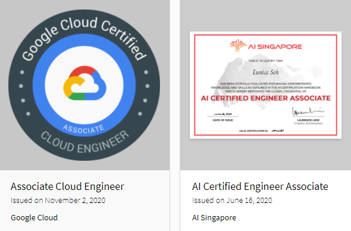

# Hello! 

👋🏼 My name is Eunice Soh. Currently, I'm open for work from Aug 2021 when I graduate from my MSc programme at the National University of Singapore. 

I've some knowledge or experience in:
💼 Data analysis using R & Python
💼 Machine learning end-to-end products using Python
💼 Full stack development using Javascript (Mongodb Express React Node)
💼 Android development using Java (Android Studio)
💼 Google Cloud Platform

I'm certified with: 
🌍 Google Cloud certified Associate Cloud Engineer
🌍 AI Singapore AI Certified Engineer

## How to reach me

🌿 Contact - eunice.sjy (at) gmail (dot) com

🌿 CV & Portfolio - https://eunices.github.io/

🌿 LinkedIn - https://www.linkedin.com/in/eunicesoh/

