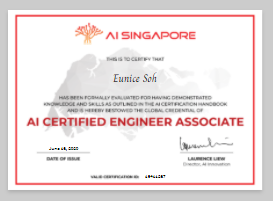

# Hello! 

👋🏼 I'm Eunice & I studied biology.   

**I've some working knowledge on:** 
💼 Software development lifecycle & Git/Github 
💼 R and Python to conduct data analysis 

**Previously certified in:** 🌍 Google Cloud certified Associate Cloud Engineer
🌍 AI Singapore AI Certified Engineer

